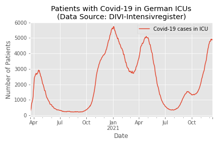
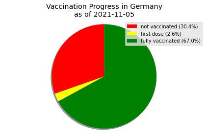
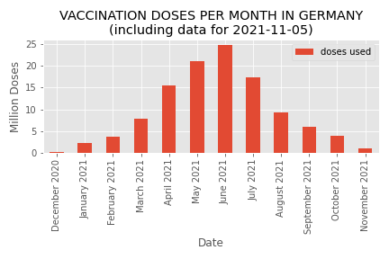

# Tracking Covid 19

A couple of Jupyter Notebooks that analyze open data on Covid-19.
Main focus is the situation in Germany.

## Vaccinations in Germany

[Jupyter Notebook](vaccination.ipynb) | [PDF](vaccination.pdf)

Contains:
* doses uses (per day, week, and month),
* vaccination campaign progress (percentage of population fully vaccinated),
* vaccines in use

## ICU Capacity Utilization

[Jupyter Notebook](intensive-care.ipynb) | [PDF](intensive-care.pdf)

## Selected Visualizations

### Status Quo

### Measures against Covid-19

